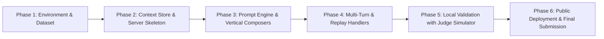

# magicpin AI Challenge — End-to-End Execution Plan

## 1. Challenge Overview
- **Objective**: Rebuild and surpass the performance of **Vera** (magicpin's WhatsApp Merchant AI Assistant) across 5 merchant verticals (**Dentists, Salons, Restaurants, Gyms, Pharmacies**).
- **Core Engine Formula**:
  $$\text{Message} = \text{compose}(\text{CategoryContext}, \text{MerchantContext}, \text{TriggerContext}, \text{CustomerContext}^?)$$
- **Judging Criteria (0–10 each, Total 50 pts)**:
  1. **Decision Quality & Trigger Relevance**: Clear reason for messaging *now*; prioritizes high-value signal over data dumping.
  2. **Specificity**: Verifiable data points (numbers, deltas %, dates, exact offer prices, source citations). Zero hallucinations.
  3. **Category Fit**: Accurate vertical voice (clinical-peer, warm-practical, operator-to-operator, motivational coach, trustworthy-precise); zero taboo violations.
  4. **Merchant Fit**: Personalized by owner name, honors language mix (natural Hinglish where preferred), local geography, active offers.
  5. **Engagement Compulsion**: Strong psychological levers (loss aversion, social proof, effort externalization), single binary/effortless CTA.
- **Post-Submission Curveballs**:
  - Incremental context injections (new digest articles, performance metrics shift, new triggers).
  - Multi-turn stress replay tests (auto-reply looping, immediate intent conversion, hostile/off-topic handling).

---

## 2. Phase Breakdown

### Phase 1: Environment & Dataset Setup *(In Progress)*
- Initialize isolated virtual environment (`.venv`) adhering to repository python standards.
- Install essential dependencies (`fastapi`, `uvicorn`, `pydantic`, `httpx`, `python-dotenv`).
- Expand synthetic seed dataset using `dataset/generate_dataset.py` into `expanded/` (50 merchants, 200 customers, 100 triggers, 30 canonical benchmark test pairs).
- Verify data integrity across all generated JSON contexts.

### Phase 2: Context Store & FastAPI Endpoint Skeleton
- Implement in-memory, thread-safe storage for Category, Merchant, Customer, and Trigger contexts.
- Handle versioning and atomic update semantics (`POST /v1/context`):
  - Idempotent on `(scope, context_id, version)`.
  - Reject stale versions with HTTP 409.
  - Higher versions atomically replace prior state.
- Expose liveness probe (`GET /v1/healthz`) and metadata (`GET /v1/metadata`).
- Expose basic request routing for `POST /v1/tick` and `POST /v1/reply`.

### Phase 3: High-Compulsion Prompt Architecture & Dispatcher
- Develop modular vertical prompt builders tailored to the 5 categories.
- Integrate context extractors:
  - Provenance tracking (verifiable figures only, no hallucinations).
  - Language detector & Hinglish synthesizer for merchants with `hi` language preference.
  - Compulsion hooks (loss aversion, social proof, effort externalization).
  - Single binary CTA formatter (YES/STOP, low-friction next step).
- Connect to high-performing, deterministic LLM completions with fallback heuristics.

### Phase 4: Multi-Turn Conversation Handlers & Edge Cases
- **Auto-Reply Detector**: Detect canned automated messages from WhatsApp Business and exit gracefully (`action: "end"`).
- **Intent Transition Handler**: Instantly switch from pitch/qualification mode to action execution when merchant commits (`"let's do it"`, `"yes"`, `"kardo"`).
- **Hostility / Opt-out Handler**: Respect STOP/unsubscribe requests with polite, non-defensive closure.
- Conversation state tracker (`conversation_id -> history`) to prevent repetitive copy.

### Phase 5: Local Simulation & Rubric Benchmarking
- Configure and run `judge_simulator.py` locally against the running server.
- Validate all test scenarios:
  1. `warmup` (healthz, metadata, context ingestion)
  2. `auto_reply_hell` (detecting canned loops)
  3. `intent_transition` (switching to action mode)
  4. `hostile` (handling abuse/cancellation)
  5. `phase2_short` (tick proactive actions)
  6. `full_evaluation` (batch scoring across all triggers)
- Iteratively refine prompt templates until scores exceed 45/50.

### Phase 6: Public Deployment & Submission Deliverables
- Deploy bot server to a publicly accessible HTTPS URL (Cloud Run / Render / Fly.io / ngrok).
- Generate the canonical `submission.jsonl` covering the 30 benchmark test pairs.
- Author concise 1-page `README.md` documenting architecture, design trade-offs, and prompts.
- Submit the live URL on the magicpin challenge portal.
